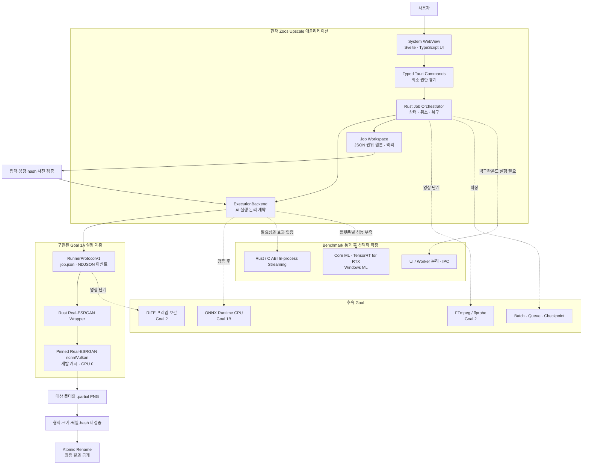
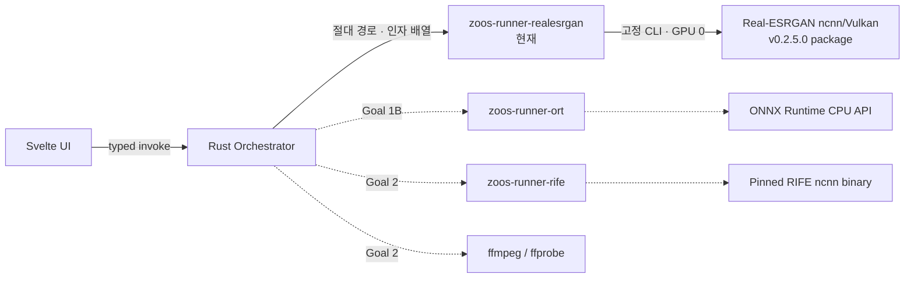
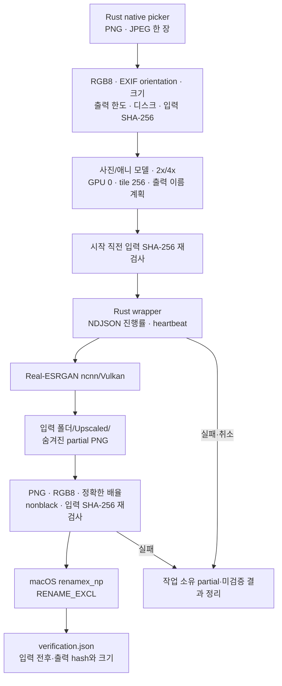
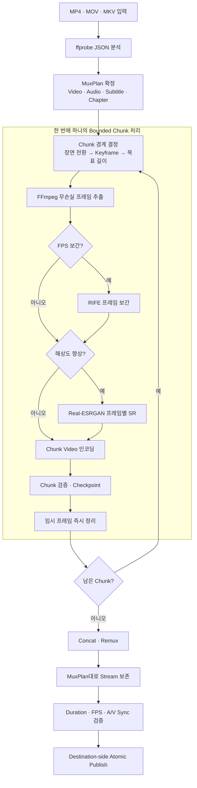
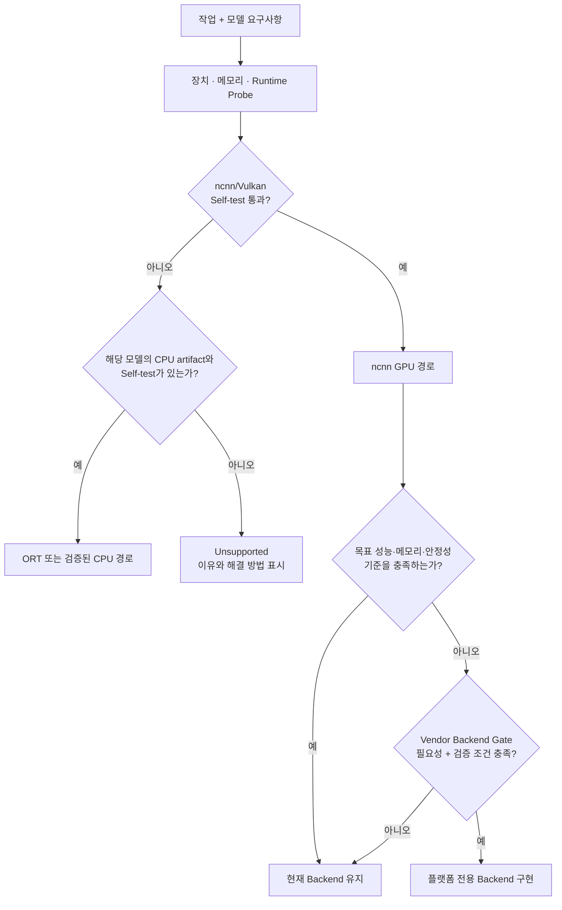
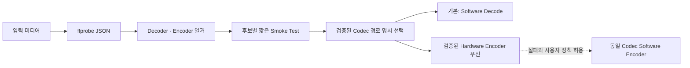
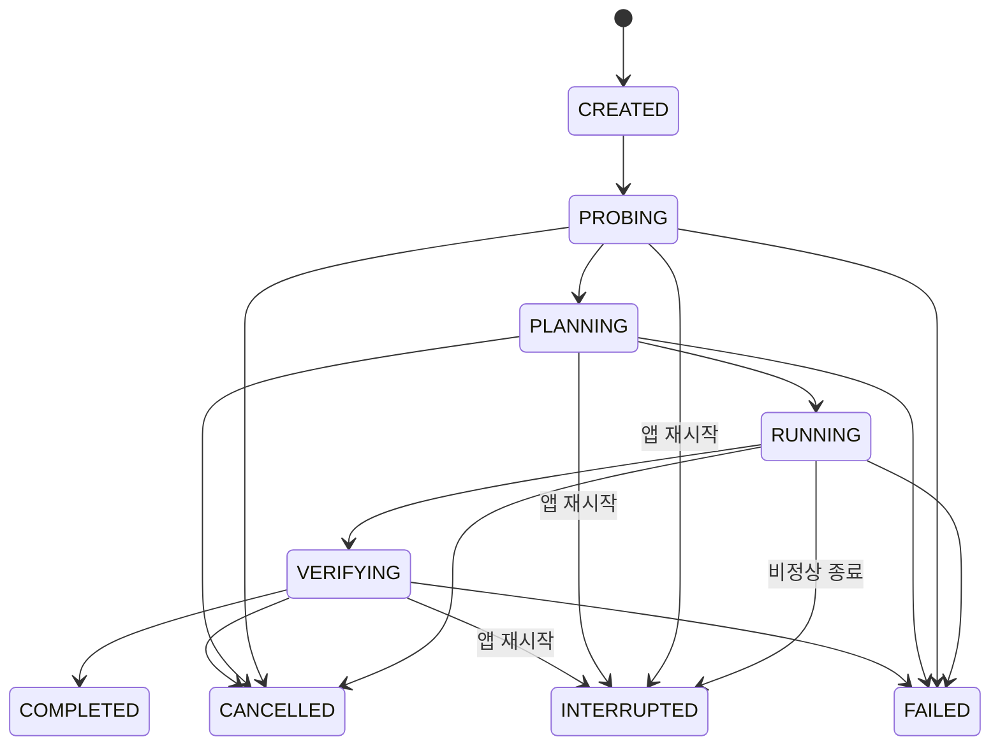
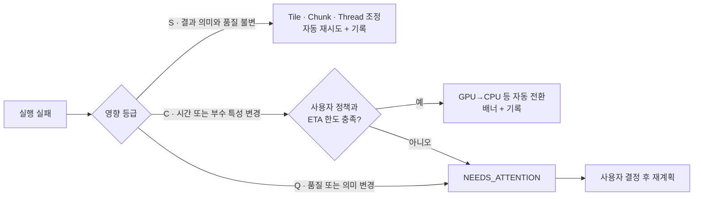
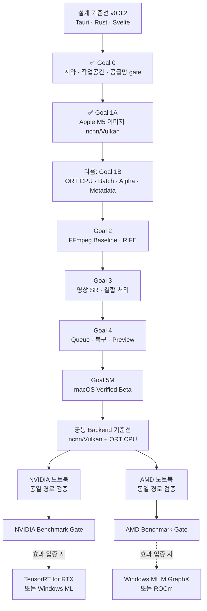

# Zoos Upscale 기술 아키텍처

[← 프로젝트 소개로 돌아가기](README.md)

> 이 문서는 Zoos Upscale의 공개 기술 개요입니다. **현재 구현된 범위**와 **후속 설계**를 구분해 기록합니다.

**문서 상태:** 설계 기준선 v0.3.2 · Goal 0/1A 구현 반영 · **최종 갱신:** 2026-08-26

## 1. 설계 목표

Zoos Upscale은 이미지 업스케일링, 영상 업스케일링, 프레임 보간을 하나의 데스크톱 앱에서 처리합니다.

설계가 해결하려는 핵심 문제는 다음과 같습니다.

1. 사용자는 AI 모델이나 GPU 설정 대신 원하는 결과를 선택합니다.
2. 파일과 AI 추론은 기본적으로 로컬에서 처리합니다.
3. 원본 파일은 수정하지 않습니다.
4. 긴 영상은 작은 구간으로 나누어 처리하고 중단된 지점부터 재개합니다.
5. GPU 실패가 품질 저하로 조용히 이어지지 않도록 모든 대체 경로를 기록합니다.
6. 첫 제품은 단순하게 만들고, 복잡한 전용 백엔드는 실제 성능 자료가 있을 때만 추가합니다.

### 현재 구현 상태

| 범위 | 상태 | 근거 |
|---|---|---|
| Goal 0 | 완료 | 범용 작업 계약, schema 생성, process 생명주기, workspace lock·staging·quarantine, 라이선스 gate |
| Goal 1A | 완료 | 단일 RGB8 PNG/JPEG, 사진·애니, 2배·4배, Real-ESRGAN ncnn/Vulkan GPU 0, 안전한 PNG 공개 |
| Apple M5 gate | 통과 | 8개 조합×3회, 정확한 크기·RGB8·nonblack·원본 hash 불변, 골든 오차 0, 취소 후 잔존 0 |
| 공개 배포 | 차단 | 모델 가중치 재배포 권리 미확인으로 엔진·모델·개발 Fake Runner를 release bundle에서 제외 |

현재 지원 표시는 **Apple M5에서 직접 통과한 Goal 1A 범위**에만 적용합니다. ORT CPU, batch, alpha, metadata 보존, FFmpeg·RIFE, Windows Job Object와 NVIDIA·AMD 검증은 아직 후속 단계입니다.

## 2. 전체 시스템 구조



### 구성요소별 책임

| 구성요소 | 책임 | 직접 알지 않아야 하는 것 |
|---|---|---|
| UI | 파일 선택, 결과 설정, 진행률, 오류·복구 안내 | 개별 실행 파일의 명령행 인자 |
| Typed Tauri Commands | UI 요청 검증, 최소 기능만 Rust에 전달 | 범용 shell 실행과 sidecar 경로 |
| Job Orchestrator | 작업 계획, 단일 active 작업, 상태 전이, 취소와 시작 복구 | 모델별 네이티브 API 세부사항 |
| ExecutionBackend | AI 작업의 공통 실행 계약과 capability probe | process runner의 전송 형식 |
| ProcessExecutionBackend | runner 실행, 이벤트 수집, 취소와 오류 정규화 | 사용자 화면 구성 |
| Media Probe / Selector | 후속 영상 단계의 stream 분석, decode·encode 경로 선택 | AI 모델 선택 정책 |
| Job Workspace | 계획, 진행 상태, manifest·로그·이미지 검증 기록 | UI 표현 방식 |
| Runner | 하나의 AI 실행기를 공통 프로토콜로 감싸기 | 전체 작업 Queue와 제품 정책 |

## 3. 실행 경계와 프로세스 구조

MVP는 논리적으로 **Tauri 앱과 격리된 runner 자식 프로세스**로 구성합니다. 운영체제의 WebView helper 같은 내부 프로세스 수를 하나로 제한한다는 뜻은 아닙니다.

### 구현 언어 상태

승인된 생산 기준선은 **Tauri v2 + Rust Orchestrator + Svelte·TypeScript·Vite UI**입니다. 프로젝트 코드는 Apache-2.0으로 공개하고 앱 식별자는 `com.zooslab.zoosupscale`을 사용합니다.

| 영역 | 관리 도구 | 제품 포함 여부 |
|---|---|---|
| Rust core·runner | Cargo + `Cargo.lock` | 포함 |
| Svelte UI | pnpm + `pnpm-lock.yaml` | 정적 자산으로 포함 |
| 모델 export·변환·품질 평가 | Python 3.12+ + uv + `uv.lock` | **개발 도구 전용, 제품에 미포함** |

Svelte frontend에는 범용 shell 권한을 주지 않습니다. UI는 좁은 typed Tauri command만 호출하고, sidecar 경로·인자·실행·취소·출력 검증은 Rust Orchestrator가 전담합니다.



- 실행 파일은 앱이 알고 있는 절대 경로로만 호출합니다.
- Tauri capability는 window와 typed command 단위로 최소화하며 frontend에 shell 실행 권한을 주지 않습니다.
- 셸, `system()`, `cmd.exe /c`, PowerShell을 경유하지 않습니다.
- runner의 stdout은 구조화된 NDJSON 이벤트 전용입니다.
- 취소 시 자식과 손자 프로세스까지 함께 종료합니다.
- 실행 파일과 모델은 catalog의 SHA-256으로 검증하며, 권리가 확인된 자산만 배포 manifest에 승격합니다.

### RunnerProtocolV1의 현재 역할

| 구간 | 형식 | 목적 |
|---|---|---|
| 기능 조회 | Capabilities JSON | 지원 작업, 모델, 장치, 버전 확인 |
| 작업 입력 | `job.json` | 입력·출력·모델·장치·tile 등 명시 |
| 실행 이벤트 | NDJSON | 시작, 진행률, 경고, 완료, 실패 전달 |
| 오류 분류 | 표준 오류 코드 | 입력 오류, 모델 누락, GPU 오류, OOM, 취소 등 구분 |
| 취소 | Process tree 종료 | 고아 프로세스와 불완전 결과 방지 |

Rust 타입이 `RunnerProtocolV1`의 권위 원본이며 `schemars`로 JSON Schema를 생성합니다. CI의 `cargo xtask schema --check`가 생성 결과의 drift를 차단합니다. native Fake Runner로 성공·명시 실패·malformed NDJSON·crash·hang·timeout·취소·terminal event와 exit code 충돌을 검증하고, 같은 계약으로 실제 Real-ESRGAN wrapper를 실행합니다. macOS에서는 별도 process group을 사용해 자식·손자 process를 함께 종료합니다.

## 4. 이미지 데이터 흐름



계획 단계에서 `<stem>_upscaled_<2|4>x.png`를 선택하고, 이미 있으면 `_2`부터 `_999`까지 첫 빈 이름을 사용합니다. 계획 뒤 다른 process가 같은 이름을 만들면 publish를 `OUTPUT_EXISTS`로 실패시키며 기존 파일은 유지합니다.

### 현재 범위와 후속 범위

| 단계 | Goal 1A 현재 선택 | Goal 1B 이후 |
|---|---|---|
| Decode·Encode | PNG/JPEG RGB8 입력, PNG RGB8 출력 | alpha 분리 처리, JPEG·WebP 출력, metadata·ICC·EXIF 보존 |
| 일반 사진 SR | `realesrgan-x4plus`, upstream scale 2 또는 4 | 별도 x2 모델·저메모리 모델은 품질·라이선스 검증 후 |
| 애니·일러스트 SR | `realesrgan-x4plus-anime`, upstream scale 2 또는 4 | `realesr-animevideov3`는 후속 후보 |
| GPU 추론 | ncnn/Vulkan GPU 0, Apple M5 검증 | NVIDIA·AMD 실제 장치 검증, 필요 시 vendor backend |
| CPU 추론 | 미지원 | ONNX Runtime CPU artifact·self-test 추가 |

이미지 자산·처리 오류 코드는 `ENGINE_NOT_INSTALLED`, `ASSET_HASH_MISMATCH`, `UNSUPPORTED_IMAGE_MODE`, `OUTPUT_TOO_LARGE`, `INSUFFICIENT_DISK`, `OUTPUT_EXISTS`, `INPUT_CHANGED`, `GPU_UNAVAILABLE`, `UPSTREAM_FAILED`, `CANCELLED`로 고정합니다. 명령 상태 오류는 `JOB_BUSY`, `JOB_NOT_ACTIVE`, `INVALID_JOB_STATE`로 별도 구분합니다.

## 5. 영상 데이터 흐름

이 절은 **Goal 2~3 후속 설계**이며 현재 앱에는 아직 FFmpeg·RIFE 영상 경로가 없습니다.



### 지원 범위

| 항목 | 첫 정식 범위 | 후속 또는 명시적 거부 |
|---|---|---|
| 영상 형태 | SDR, progressive, CFR | HDR, interlaced는 후속 |
| 컨테이너 | MP4, MOV, MKV | 그 외는 capability probe 후 판정 |
| Video stream | 1개 | 복수 video stream은 후속 |
| Audio stream | 0개 이상 | 자동 제거 금지 |
| Subtitle | 기본 text subtitle | bitmap subtitle·font attachment는 후속 |
| 프레임 보간 | 25→50, 30→60, 29.97→59.94 | 24→60, 23.976→59.94는 cadence 검증 후 |
| 영상 SR | 프레임 독립형 Real-ESRGAN | 시간 일관성 VSR은 후속 |

MVP의 영상 SR은 각 프레임을 독립적으로 처리하므로 세밀한 질감이 프레임마다 흔들리는 현상이 생길 수 있습니다. 시간 일관성이 필요한 모델은 별도 연구 단계로 분리합니다.

## 6. 모델 후보군

후보 표의 상태는 다음 의미입니다.

- **검증됨:** 현재 artifact와 실제 장치 회귀 테스트가 있음
- **계획:** 다음 Goal에 필요하지만 아직 제품 경로가 없음
- **후보:** 변환 가능성, 품질, 속도 또는 라이선스를 실측한 뒤 선택
- **연구:** 첫 Beta 이후 필요성이 확인될 때만 검토

### 작업별 모델 후보

| 작업 | 콘텐츠 | 모델 후보 | 예상 artifact | 상태 |
|---|---|---|---|---|
| 이미지 SR | 사진·일반 2배·4배 | RealESRGAN x4plus | ncnn `.param/.bin` | **Apple M5 검증됨** |
| 이미지 SR | 애니·일러스트 2배·4배 | RealESRGAN x4plus anime 6B | ncnn `.param/.bin` | **Apple M5 검증됨** |
| 이미지 SR | 사진·일반 CPU | RealESRGAN ONNX | ONNX FP32 | Goal 1B 계획 |
| 이미지 SR | 사진 전용 2배 | RealESRGAN x2plus | ONNX 또는 변환된 ncnn | 후보 |
| 이미지 SR | 저메모리·빠른 처리 | realesr-general-x4v3 | 변환 artifact | 후보 |
| 영상 SR | 일반 영상 | 이미지 SR 모델의 프레임별 적용 | ncnn / ONNX | Goal 3 계획 |
| 영상 SR | 애니메이션 | realesr-animevideov3 | ncnn `.param/.bin` | 후보 |
| 프레임 보간 | 일반·애니 영상 | RIFE, 검증 후 버전 고정 | ncnn model 또는 ONNX | Goal 2 계획 |
| 시간 일관성 영상 SR | 일반 영상 | RealBasicVSR 계열 | 미정 | 연구 |
| 고급 이미지 SR | 사진·일러스트 | SPAN, HAT 계열 | 미정 | 연구 |
| 얼굴 복원 | 인물 | GFPGAN 계열 | 미정 | 연구·명시적 선택 |
| 생성형 세부 복원 | 사진 | 생성형 복원 모델 | 미정 | 연구·명시적 선택만 허용 |

모델 이름만으로 채택하지 않습니다. 실제 배포에는 모델 출처, 버전, 원본 hash, 변환 도구 버전, 변환된 artifact hash, 코드 라이선스와 가중치 라이선스를 각각 기록합니다.

## 7. 실행 백엔드 후보군

AI 모델과 실행 엔진은 분리합니다. 동일한 작업도 장치에 따라 다른 artifact와 엔진을 사용할 수 있습니다.

| Backend | 대상 장치 | 역할 | 도입 단계 |
|---|---|---|---|
| ncnn / Vulkan | Apple M5 GPU 0 | Goal 1A 이미지 SR | **현재 검증됨** |
| ncnn / Vulkan | NVIDIA·AMD 등 호환 GPU | 공통 이미지·영상 GPU 경로 | 해당 실장치 검증 전 후보 |
| ONNX Runtime CPU | CPU | 이미지·영상 SR의 안전한 CPU 대체 경로 | Goal 1B 계획 |
| RIFE ncnn CPU (`-g -1`) | CPU | 프레임 보간 CPU 후보 | Goal 2 실측 후 확정 |
| RIFE ONNX + ORT CPU | CPU | 프레임 보간 CPU 후보 | Goal 2 실측 후 확정 |
| Core ML | Apple Silicon | macOS 전용 성능·전력 최적화 | Benchmark 통과 시 |
| TensorRT for RTX | NVIDIA RTX | Windows NVIDIA 최적화 | Benchmark 통과 시 |
| Windows ML NvTensorRtRtx EP | NVIDIA RTX | Windows 관리형 NVIDIA 경로 | Benchmark 통과 시 |
| Windows ML MIGraphX EP | AMD GPU | Windows AMD 경로 | Benchmark 통과 시 |
| Windows ML OpenVINO EP | Intel GPU | Windows Intel 경로 | Benchmark 통과 시 |
| 직접 ROCm / MIGraphX | AMD GPU | Linux AMD 경로 | 실제 목표 장치 확보 후 |
| Rust / C ABI In-process ncnn | 여러 장치 | process·중간 파일 병목 제거 | 병목이 측정된 경우 |

### 목표 Backend 선택 과정

아래는 Goal 1B 이후의 목표 정책입니다. Goal 1A는 Apple M5의 ncnn/Vulkan GPU 0만 허용하며 GPU 실패를 CPU로 자동 전환하지 않습니다.



플랫폼 전용 Backend는 단순히 사용할 수 있다는 이유로 추가하지 않습니다. 대표 workload에서 처리 시간, peak memory, 배터리·발열, 장시간 안정성 또는 실행 가능성의 유의미한 개선이 있고 실제 장치 회귀 테스트를 유지할 수 있을 때만 도입합니다.

## 8. FFmpeg 미디어 계층

이 절은 **Goal 2 후속 설계**입니다. FFmpeg는 도입할 때 AI Backend와 별도로 관리합니다.



- `-hwaccel auto`에 제품 정책을 맡기지 않습니다.
- FFmpeg의 자동 stream selection 대신 명시적인 `-map`과 MuxPlan을 사용합니다.
- Hardware decode는 중간 프레임 복사 비용까지 포함한 benchmark에서 이득이 있을 때만 사용합니다.
- FFmpeg binary, configure flags, codec 목록과 license 조건을 release manifest에 기록합니다.

## 9. 작업 상태와 재개



현재 앱은 한 번에 하나의 active 작업만 실행합니다. batch queue, pause/resume, checkpoint 재개와 `NEEDS_ATTENTION` 재계획은 후속 Goal입니다. 앱 재시작 시 이전 active 작업은 자동 재개하지 않고 `INTERRUPTED`로 표시하며, 소유가 증명된 partial만 정리합니다.

### Workspace 구조

```text
job-workspaces/
├── .workspace.lock
├── staging/                # 완성 전 작업; 완성 뒤 UUID 폴더로 atomic rename
├── quarantine/             # 손상·불완전 작업과 diagnostic JSON
└── <job-id>/
    ├── job-spec.json       # v2 이미지 또는 메모리 변환 가능한 v1 Fake spec
    ├── plan.json
    ├── runner-job.json
    ├── plan-revisions.jsonl
    ├── manifest.json
    ├── progress.json       # 현재 lifecycle의 권위 원본
    ├── logs.jsonl
    └── verification.json   # 성공한 이미지의 입출력 검증 증거
```

프로세스는 `fs4` root exclusive lock을 보유하고 앱은 single-instance plugin으로 중복 실행을 차단합니다. JSONL의 마지막 미완성 tail만 안전하게 truncate하며, 중간 손상과 symlink·구조 위반은 진단 파일과 함께 격리합니다. 손상된 작업 하나가 정상 작업 목록이나 앱 시작을 막지 않습니다.

SQLite는 MVP의 권위 저장소로 사용하지 않습니다. 작업 상태는 workspace의 JSON 파일이 소유하며, 추후 목록 검색용 index가 필요해져도 workspace에서 다시 만들 수 있는 cache로만 사용합니다.

## 10. Fallback 정책

아래 자동·조건부 fallback은 **Goal 1B 이후 목표 정책**입니다. 현재 Goal 1A는 설정을 바꾸어 재시도하거나 CPU로 자동 전환하지 않고 구조화 오류로 종료합니다.



| 등급 | 예 | 기본 동작 |
|---|---|---|
| S — Safe | tile·chunk 축소, thread 조정, 동일 설정 재시도 | 자동 수행하고 기록 |
| C — Conditional | GPU→CPU, 동일 codec의 HW→SW encoder | 사용자 정책과 ETA 한도 안에서만 자동 |
| Q — Quality/Meaning | 모델·해상도·FPS 변경, HDR→SDR, stream 제거 | 자동 금지, 사용자 결정 요청 |

## 11. 모델 패키지와 공급망

### Goal 1A 개발 자산

현재 자산의 권위 정보는 [`assets/catalog/realesrgan-ncnn-vulkan-macos.json`](assets/catalog/realesrgan-ncnn-vulkan-macos.json)에 있습니다.

- 공식 Real-ESRGAN macOS package `v0.2.5.0`과 archive SHA-256을 고정합니다.
- provenance에 Real-ESRGAN ncnn runner `v0.2.0`, source commit과 ncnn commit을 기록합니다.
- `pnpm engine:fetch`만 네트워크를 사용하며 빌드·앱 실행 중 자동 다운로드하지 않습니다.
- ZIP의 절대 경로, `..`, backslash 경로와 symlink를 거부하고 universal arm64+x86_64 실행기 1개와 사진·애니 모델 파일 4개만 추출합니다.
- 설치된 cache에도 allowlist 밖의 파일이 있으면 거부합니다. 샘플 미디어와 `animevideov3`는 추출하지 않습니다.
- catalog의 `approved_for_distribution`과 `bundled_in_release`는 모두 `false`입니다. release 검사에서 Fake Runner, upstream engine과 model weight 포함을 차단합니다.

아래 구조는 Goal 1B 이후 정식 모델 패키지로 승격할 때의 목표 형식입니다.

```text
models/<model-id>/<version>/
├── manifest.json
├── checksums.sha256
├── LICENSE.txt
└── artifacts/
    ├── ncnn/
    │   ├── model.param
    │   └── model.bin
    └── onnx/fp32/
        └── model.onnx
```

각 모델 패키지는 다음 정보를 가져야 합니다.

- 작업 유형, 배율, 입력 색·형태, tile 요구사항
- 지원 Backend별 artifact와 SHA-256
- 변환 전 모델과 변환 도구의 provenance
- 코드 라이선스와 가중치 라이선스
- Backend별 golden test 통과 상태
- 실행 코드·스크립트·설치 hook 미포함

### 현재 확인한 코드 라이선스

| 구성요소 | 코드 라이선스 | 확인 위치 |
|---|---|---|
| Real-ESRGAN | BSD 3-Clause | [LICENSE](https://github.com/xinntao/Real-ESRGAN/blob/master/LICENSE) |
| Real-ESRGAN ncnn Vulkan | MIT | [LICENSE](https://github.com/xinntao/Real-ESRGAN-ncnn-vulkan/blob/master/LICENSE) |
| ncnn | BSD 3-Clause | [LICENSE](https://github.com/Tencent/ncnn/blob/master/LICENSE.txt) |
| RIFE ncnn Vulkan | MIT | [LICENSE](https://github.com/nihui/rife-ncnn-vulkan/blob/master/LICENSE) |
| ONNX Runtime | MIT | [LICENSE](https://github.com/microsoft/onnxruntime/blob/main/LICENSE) |
| Zoos Upscale | Apache-2.0 | [LICENSE](LICENSE) |
| Tauri · Svelte · Rust crate | 각 upstream 라이선스 | lockfile·`cargo-deny`·pnpm inventory로 관리 |
| FFmpeg | 빌드 옵션에 따라 별도 검토 | Goal 2에서 configure flags와 배포 조합 확정 |

이 표는 코드 저장소의 라이선스만 요약합니다. 모델 가중치, 변환 artifact, codec과 전이 의존성의 재배포 조건은 별도로 확인합니다. Rust는 `cargo-deny 0.20.2`, JavaScript는 고정 lockfile 기반 license inventory를 CI gate로 사용합니다.

## 12. 검증을 통과해야 지원되는 것

후보 모델이나 Backend는 다음 항목을 통과하기 전까지 제품에서 **지원됨**으로 표시하지 않습니다.

1. 배포 artifact를 재현 가능하게 생성할 수 있어야 합니다.
2. 입력·출력 tensor와 색공간 계약이 명확해야 합니다.
3. CPU·GPU 결과가 fixture별 화질 허용 오차를 통과해야 합니다.
4. 목표 해상도에서 메모리와 장시간 안정성 기준을 통과해야 합니다.
5. 취소·OOM·driver 오류가 구조화된 실패로 전달되어야 합니다.
6. 코드와 모델 가중치의 재배포 조건을 각각 확인해야 합니다.
7. 실제 장치에서 검증하지 않은 조합은 `Verified`로 표시하지 않습니다.

## 13. 플랫폼 전략

| 순서 | 플랫폼 | 첫 목표 |
|---|---|---|
| 1 | macOS Apple Silicon | MoltenVK·runner·FFmpeg를 포함한 서명·notarization Beta |
| 2 | Windows x64 | Vulkan, Job Object, installer, driver compatibility |
| 3 | Linux x64 | 배포판, Vulkan driver, package와 codec runtime 검증 |

CI에서 빌드에 성공한 것과 실제 하드웨어에서 안정적으로 동작하는 것은 별개의 지원 등급으로 관리합니다.

## 14. 구현 순서



각 Goal은 빌드와 테스트가 통과하고 사용자가 확인할 수 있는 실행 상태를 남겨야 완료됩니다.

| 단계 | 상태 | 사용하는 장치 | 종료 조건 |
|---|---|---|---|
| Goal 0 shell·계약·안전성 | 완료 | 로컬 Mac + CI | Fake Runner process 실패·취소, schema, workspace 복구, 공급망 gate 통과 |
| Goal 1A 이미지 GPU | 완료 | Apple M5 | 8조합×3회, golden 기준, 원본 불변, atomic output, 취소 잔존 0 |
| Goal 1B 이미지 호환성 | 다음 | 로컬 Mac CPU | ORT 결과 허용 오차, batch·alpha·metadata 정책 통과 |
| 영상 MVP | 예정 | 로컬 Mac | 1분 fixture의 FPS·duration·A/V sync·stream 보존 통과 |
| macOS Beta | 예정 | 별도 clean Mac 환경 | 설치·서명·장시간 처리·강제 종료 복구 통과 |
| NVIDIA·AMD 검증 | 예정 | 각 GPU 노트북 | 먼저 ncnn/Vulkan 공통 경로와 ORT CPU 결과 비교 |
| 전용 Backend | 조건부 | 해당 GPU 노트북 | 공통 경로 대비 성능·메모리·안정성 개선과 지속 회귀 테스트 확보 |

## 15. Upstream 참고 자료

- [Real-ESRGAN](https://github.com/xinntao/Real-ESRGAN) — 일반 이미지·애니메이션용 SR 모델과 model zoo
- [Real-ESRGAN ncnn Vulkan](https://github.com/xinntao/Real-ESRGAN-ncnn-vulkan) — ncnn/Vulkan 실행기
- [RIFE ncnn Vulkan](https://github.com/nihui/rife-ncnn-vulkan) — 프레임 보간 실행기
- [ncnn](https://github.com/Tencent/ncnn) — CPU·Vulkan GPU 추론 프레임워크
- [ONNX Runtime](https://github.com/microsoft/onnxruntime) — ONNX 기반 CPU 대체 경로
- [FFmpeg](https://ffmpeg.org/documentation.html) — 미디어 probe·decode·encode·mux
- [Tauri](https://tauri.app/) — 데스크톱 shell·command·capability 경계
- [Svelte](https://svelte.dev/) — System WebView에 렌더링하는 사용자 UI
- [Rust](https://www.rust-lang.org/) — 작업 Orchestrator와 native sidecar 구현

> 위 프로젝트의 코드 라이선스와 개별 모델 가중치의 라이선스는 동일하다고 가정하지 않습니다. 실제 배포 전 구성요소별 inventory와 고지 의무를 별도로 검토합니다.
