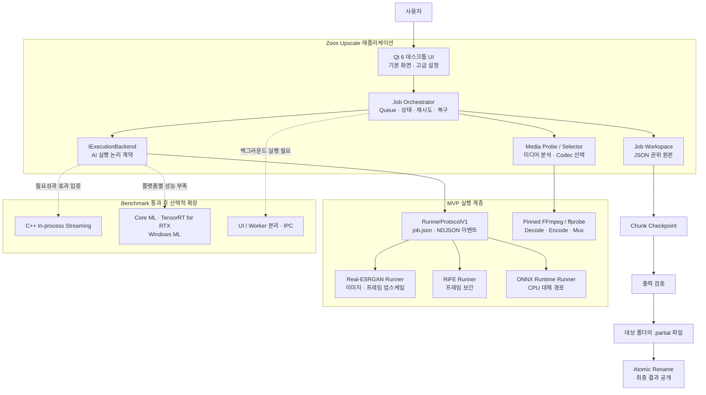
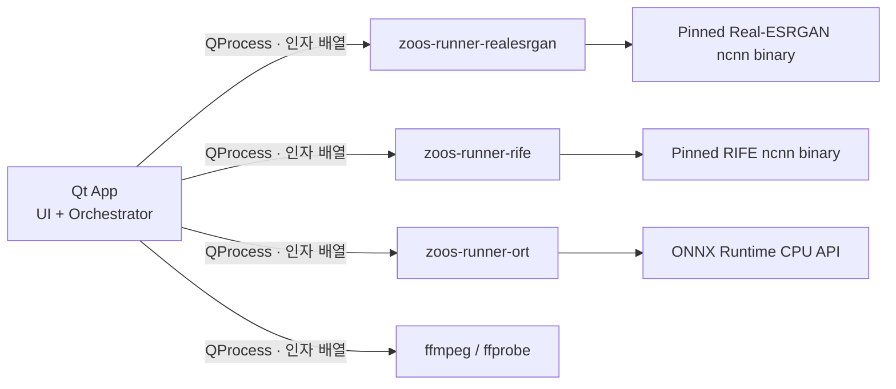
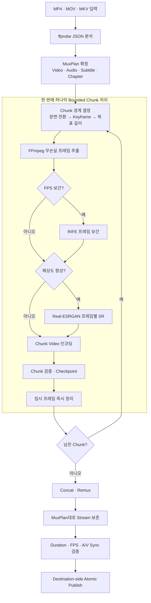
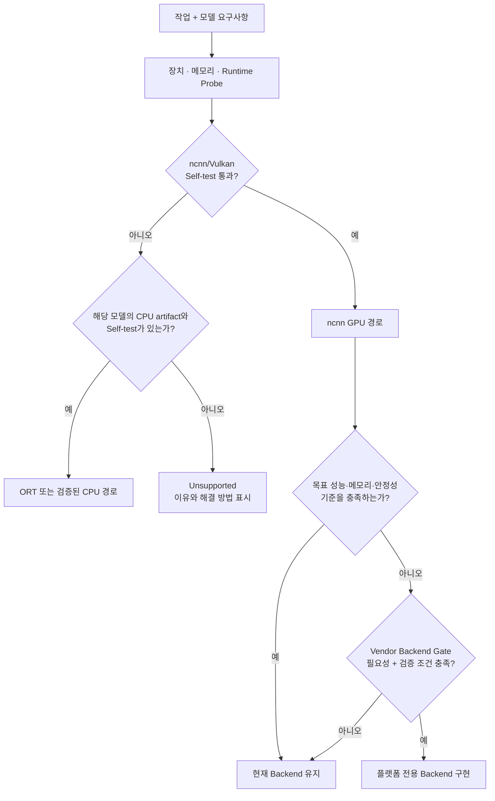
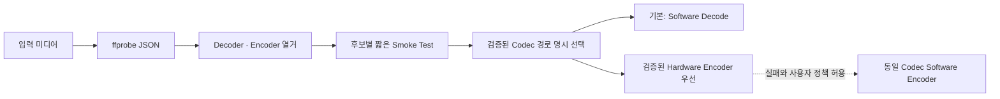
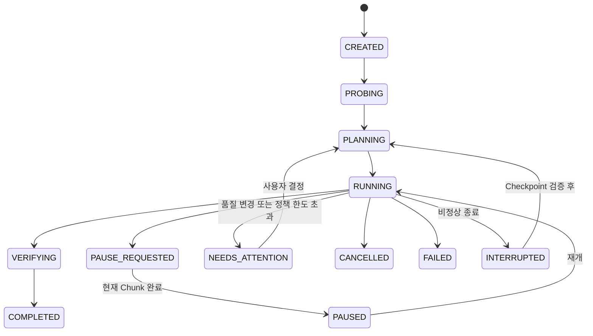
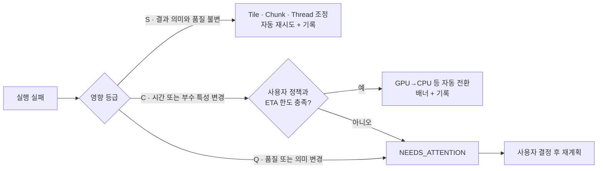
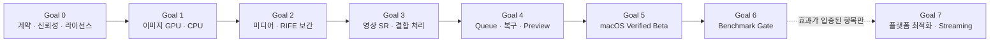

# Zoos Upscale 기술 아키텍처

[← 프로젝트 소개로 돌아가기](README.md)

> 이 문서는 Zoos Upscale의 공개 기술 개요입니다. 아직 구현 전이므로 실제 성능 검증과 라이선스 검토 결과에 따라 세부 선택은 달라질 수 있습니다.

**문서 상태:** 설계 기준선 · **최종 갱신:** 2026-08-26

## 1. 설계 목표

Zoos Upscale은 이미지 업스케일링, 영상 업스케일링, 프레임 보간을 하나의 데스크톱 앱에서 처리합니다.

설계가 해결하려는 핵심 문제는 다음과 같습니다.

1. 사용자는 AI 모델이나 GPU 설정 대신 원하는 결과를 선택합니다.
2. 파일과 AI 추론은 기본적으로 로컬에서 처리합니다.
3. 원본 파일은 수정하지 않습니다.
4. 긴 영상은 작은 구간으로 나누어 처리하고 중단된 지점부터 재개합니다.
5. GPU 실패가 품질 저하로 조용히 이어지지 않도록 모든 대체 경로를 기록합니다.
6. 첫 제품은 단순하게 만들고, 복잡한 전용 백엔드는 실제 성능 자료가 있을 때만 추가합니다.

## 2. 전체 시스템 구조



### 구성요소별 책임

| 구성요소 | 책임 | 직접 알지 않아야 하는 것 |
|---|---|---|
| UI | 파일 선택, 결과 설정, 진행률, 오류·복구 안내 | 개별 실행 파일의 명령행 인자 |
| Job Orchestrator | 작업 계획, Queue, 상태 전이, Fallback, 재개 | 모델별 네이티브 API 세부사항 |
| IExecutionBackend | AI 작업의 공통 실행 계약 | process runner의 전송 형식 |
| ProcessExecutionBackend | runner 실행, 이벤트 수집, 취소와 오류 정규화 | 사용자 화면 구성 |
| Media Probe / Selector | 입력 stream 분석, decode·encode 경로 선택 | AI 모델 선택 정책 |
| Job Workspace | 계획, 진행 상태, checkpoint, 실제 실행 결과 기록 | UI 표현 방식 |
| Runner | 하나의 AI 실행기를 공통 프로토콜로 감싸기 | 전체 작업 Queue와 제품 정책 |

## 3. 실행 경계와 프로세스 구조

MVP는 **단일 앱 프로세스와 여러 자식 프로세스**로 구성합니다.



- 실행 파일은 앱이 알고 있는 절대 경로로만 호출합니다.
- 셸, `system()`, `cmd.exe /c`, PowerShell을 경유하지 않습니다.
- runner의 stdout은 구조화된 NDJSON 이벤트 전용입니다.
- 취소 시 자식과 손자 프로세스까지 함께 종료합니다.
- 실행 파일, 모델, 빌드 옵션과 SHA-256을 배포 manifest에 고정합니다.

### RunnerProtocolV1의 계획된 역할

| 구간 | 형식 | 목적 |
|---|---|---|
| 기능 조회 | Capabilities JSON | 지원 작업, 모델, 장치, 버전 확인 |
| 작업 입력 | `job.json` | 입력·출력·모델·장치·tile 등 명시 |
| 실행 이벤트 | NDJSON | 시작, 진행률, 경고, 완료, 실패 전달 |
| 오류 분류 | 표준 오류 코드 | 입력 오류, 모델 누락, GPU 오류, OOM, 취소 등 구분 |
| 취소 | Process tree 종료 | 고아 프로세스와 불완전 결과 방지 |

프로토콜의 정확한 JSON Schema와 상태 전이는 Goal 0에서 테스트와 함께 고정합니다.

## 4. 이미지 데이터 흐름

```mermaid
flowchart LR
    INPUT["PNG · JPEG 입력"] --> DECODE["Decode"]
    DECODE --> NORMALIZE["EXIF 방향 적용<br/>RGB · Alpha 정규화"]
    NORMALIZE --> PLAN["모델 · 배율 · Tile 계획"]
    PLAN --> INFER["AI Super Resolution"]
    INFER --> BLEND["Tile 결합 · 후처리 Resize"]
    BLEND --> META["ICC · Metadata 정책 적용"]
    META --> TEMP["대상 폴더에 .partial 인코딩"]
    TEMP --> VALIDATE["크기 · 형식 · 결과 검증"]
    VALIDATE --> RENAME["최종 이름으로 Atomic Rename"]
```



### 이미지 단계별 후보

| 단계 | MVP 선택 | 대체·후속 후보 | 비고 |
|---|---|---|---|
| Decode·Encode | Qt 이미지 계층 또는 검증된 codec 라이브러리 | 플랫폼별 이미지 codec | 알파·ICC·EXIF 정책을 앱이 통제 |
| 일반 사진 SR | RealESRGAN x4plus | RealESRGAN x2plus, realesr-general-x4v3 | 직접 2배 모델과 저메모리 모델은 별도 검증 |
| 애니·일러스트 SR | RealESRGAN x4plus anime | realesr-animevideov3 | 콘텐츠 오분류 시 사용자 변경 가능 |
| GPU 추론 | ncnn / Vulkan | Core ML, TensorRT for RTX, Windows ML | Benchmark Gate 통과 시에만 추가 |
| CPU 추론 | ONNX Runtime CPU | 플랫폼별 CPU 최적화 | backend별 품질 비교 필수 |

## 5. 영상 데이터 흐름



### 지원 범위

| 항목 | 첫 정식 범위 | 후속 또는 명시적 거부 |
|---|---|---|
| 영상 형태 | SDR, progressive, CFR | HDR, interlaced는 후속 |
| 컨테이너 | MP4, MOV, MKV | 그 외는 capability probe 후 판정 |
| Video stream | 1개 | 복수 video stream은 후속 |
| Audio stream | 0개 이상 | 자동 제거 금지 |
| Subtitle | 기본 text subtitle | bitmap subtitle·font attachment는 후속 |
| 프레임 보간 | 25→50, 30→60, 29.97→59.94 | 24→60, 23.976→59.94는 cadence 검증 후 |
| 영상 SR | 프레임 독립형 Real-ESRGAN | 시간 일관성 VSR은 후속 |

MVP의 영상 SR은 각 프레임을 독립적으로 처리하므로 세밀한 질감이 프레임마다 흔들리는 현상이 생길 수 있습니다. 시간 일관성이 필요한 모델은 별도 연구 단계로 분리합니다.

## 6. 모델 후보군

후보 표의 상태는 다음 의미입니다.

- **MVP:** 첫 제품에 필요한 기본 경로
- **검증:** 변환 가능성, 품질, 속도 또는 라이선스를 실측한 뒤 선택
- **연구:** 첫 Beta 이후 필요성이 확인될 때만 검토

### 작업별 모델 후보

| 작업 | 콘텐츠 | 모델 후보 | 예상 artifact | 상태 |
|---|---|---|---|---|
| 이미지 SR | 사진·일반 | RealESRGAN x4plus | ncnn `.param/.bin`, ONNX FP32 | **MVP** |
| 이미지 SR | 사진·일반 2배 | RealESRGAN x2plus | ONNX 또는 변환된 ncnn | 검증 |
| 이미지 SR | 저메모리·빠른 처리 | realesr-general-x4v3 | 변환 artifact | 검증 |
| 이미지 SR | 애니·일러스트 | RealESRGAN x4plus anime 6B | ncnn `.param/.bin`, ONNX | **MVP** |
| 영상 SR | 일반 영상 | 이미지 SR 모델의 프레임별 적용 | ncnn / ONNX | **MVP** |
| 영상 SR | 애니메이션 | realesr-animevideov3 | ncnn `.param/.bin` | 검증 |
| 프레임 보간 | 일반·애니 영상 | RIFE, 검증 후 버전 고정 | ncnn model 또는 ONNX | **MVP** |
| 시간 일관성 영상 SR | 일반 영상 | RealBasicVSR 계열 | 미정 | 연구 |
| 고급 이미지 SR | 사진·일러스트 | SPAN, HAT 계열 | 미정 | 연구 |
| 얼굴 복원 | 인물 | GFPGAN 계열 | 미정 | 연구·명시적 선택 |
| 생성형 세부 복원 | 사진 | 생성형 복원 모델 | 미정 | 연구·명시적 선택만 허용 |

모델 이름만으로 채택하지 않습니다. 실제 배포에는 모델 출처, 버전, 원본 hash, 변환 도구 버전, 변환된 artifact hash, 코드 라이선스와 가중치 라이선스를 각각 기록합니다.

## 7. 실행 백엔드 후보군

AI 모델과 실행 엔진은 분리합니다. 동일한 작업도 장치에 따라 다른 artifact와 엔진을 사용할 수 있습니다.

| Backend | 대상 장치 | 역할 | 도입 단계 |
|---|---|---|---|
| ncnn / Vulkan | 호환 GPU 전반 | 이미지 SR·영상 SR·RIFE 기본 GPU 경로 | **MVP 필수** |
| ONNX Runtime CPU | CPU | 이미지·영상 SR의 안전한 CPU 대체 경로 | **MVP 필수** |
| RIFE ncnn CPU (`-g -1`) | CPU | 프레임 보간 CPU 후보 | Goal 2 실측 후 확정 |
| RIFE ONNX + ORT CPU | CPU | 프레임 보간 CPU 후보 | Goal 2 실측 후 확정 |
| Core ML | Apple Silicon | macOS 전용 성능·전력 최적화 | Benchmark 통과 시 |
| TensorRT for RTX | NVIDIA RTX | Windows NVIDIA 최적화 | Benchmark 통과 시 |
| Windows ML NvTensorRtRtx EP | NVIDIA RTX | Windows 관리형 NVIDIA 경로 | Benchmark 통과 시 |
| Windows ML MIGraphX EP | AMD GPU | Windows AMD 경로 | Benchmark 통과 시 |
| Windows ML OpenVINO EP | Intel GPU | Windows Intel 경로 | Benchmark 통과 시 |
| 직접 ROCm / MIGraphX | AMD GPU | Linux AMD 경로 | 실제 목표 장치 확보 후 |
| C++ In-process ncnn | 여러 장치 | process·중간 파일 병목 제거 | 병목이 측정된 경우 |

### Backend 선택 과정



플랫폼 전용 Backend는 단순히 사용할 수 있다는 이유로 추가하지 않습니다. 대표 workload에서 처리 시간, peak memory, 배터리·발열, 장시간 안정성 또는 실행 가능성의 유의미한 개선이 있고 실제 장치 회귀 테스트를 유지할 수 있을 때만 도입합니다.

## 8. FFmpeg 미디어 계층

FFmpeg는 AI Backend와 별도로 관리합니다.



- `-hwaccel auto`에 제품 정책을 맡기지 않습니다.
- FFmpeg의 자동 stream selection 대신 명시적인 `-map`과 MuxPlan을 사용합니다.
- Hardware decode는 중간 프레임 복사 비용까지 포함한 benchmark에서 이득이 있을 때만 사용합니다.
- FFmpeg binary, configure flags, codec 목록과 license 조건을 release manifest에 기록합니다.

## 9. 작업 상태와 재개



### Workspace 구조

```text
job-workspaces/<job-id>/
├── job-spec.json           # 사용자가 원하는 결과, 불변
├── plan.json               # 최초 승인된 실행 계획, 불변
├── plan-revisions.jsonl    # 재시도와 Fallback 기록
├── manifest.json           # 실제 사용한 runner·모델·backend·hash
├── progress.json           # 현재 lifecycle 상태
├── logs.jsonl              # 구조화 로그
├── chunks/
│   └── 000001/checkpoint.json
└── final/
```

SQLite는 MVP의 권위 저장소로 사용하지 않습니다. 작업 상태는 workspace의 JSON 파일이 소유하며, 추후 목록 검색용 index가 필요해져도 workspace에서 다시 만들 수 있는 cache로만 사용합니다.

## 10. Fallback 정책



| 등급 | 예 | 기본 동작 |
|---|---|---|
| S — Safe | tile·chunk 축소, thread 조정, 동일 설정 재시도 | 자동 수행하고 기록 |
| C — Conditional | GPU→CPU, 동일 codec의 HW→SW encoder | 사용자 정책과 ETA 한도 안에서만 자동 |
| Q — Quality/Meaning | 모델·해상도·FPS 변경, HDR→SDR, stream 제거 | 자동 금지, 사용자 결정 요청 |

## 11. 모델 패키지와 공급망

```text
models/<model-id>/<version>/
├── manifest.json
├── checksums.sha256
├── LICENSE.txt
└── artifacts/
    ├── ncnn/
    │   ├── model.param
    │   └── model.bin
    └── onnx/fp32/
        └── model.onnx
```

각 모델 패키지는 다음 정보를 가져야 합니다.

- 작업 유형, 배율, 입력 색·형태, tile 요구사항
- 지원 Backend별 artifact와 SHA-256
- 변환 전 모델과 변환 도구의 provenance
- 코드 라이선스와 가중치 라이선스
- Backend별 golden test 통과 상태
- 실행 코드·스크립트·설치 hook 미포함

### 현재 확인한 코드 라이선스

| 구성요소 | 코드 라이선스 | 확인 위치 |
|---|---|---|
| Real-ESRGAN | BSD 3-Clause | [LICENSE](https://github.com/xinntao/Real-ESRGAN/blob/master/LICENSE) |
| Real-ESRGAN ncnn Vulkan | MIT | [LICENSE](https://github.com/xinntao/Real-ESRGAN-ncnn-vulkan/blob/master/LICENSE) |
| ncnn | BSD 3-Clause | [LICENSE](https://github.com/Tencent/ncnn/blob/master/LICENSE.txt) |
| RIFE ncnn Vulkan | MIT | [LICENSE](https://github.com/nihui/rife-ncnn-vulkan/blob/master/LICENSE) |
| ONNX Runtime | MIT | [LICENSE](https://github.com/microsoft/onnxruntime/blob/main/LICENSE) |
| Qt · FFmpeg | 사용 모듈·빌드 옵션에 따라 검토 | Goal 0 배포·라이선스 게이트 |

이 표는 코드 저장소의 라이선스만 요약합니다. 모델 가중치, 변환 artifact, codec과 전이 의존성의 재배포 조건은 별도로 확인합니다.

## 12. 검증을 통과해야 지원되는 것

후보 모델이나 Backend는 다음 항목을 통과하기 전까지 제품에서 **지원됨**으로 표시하지 않습니다.

1. 배포 artifact를 재현 가능하게 생성할 수 있어야 합니다.
2. 입력·출력 tensor와 색공간 계약이 명확해야 합니다.
3. CPU·GPU 결과가 fixture별 화질 허용 오차를 통과해야 합니다.
4. 목표 해상도에서 메모리와 장시간 안정성 기준을 통과해야 합니다.
5. 취소·OOM·driver 오류가 구조화된 실패로 전달되어야 합니다.
6. 코드와 모델 가중치의 재배포 조건을 각각 확인해야 합니다.
7. 실제 장치에서 검증하지 않은 조합은 `Verified`로 표시하지 않습니다.

## 13. 플랫폼 전략

| 순서 | 플랫폼 | 첫 목표 |
|---|---|---|
| 1 | macOS Apple Silicon | MoltenVK·runner·FFmpeg를 포함한 서명·notarization Beta |
| 2 | Windows x64 | Vulkan, Job Object, installer, driver compatibility |
| 3 | Linux x64 | 배포판, Vulkan driver, package와 codec runtime 검증 |

CI에서 빌드에 성공한 것과 실제 하드웨어에서 안정적으로 동작하는 것은 별개의 지원 등급으로 관리합니다.

## 14. 구현 순서



각 Goal은 빌드와 테스트가 통과하고 사용자가 확인할 수 있는 실행 상태를 남겨야 완료됩니다.

## 15. Upstream 참고 자료

- [Real-ESRGAN](https://github.com/xinntao/Real-ESRGAN) — 일반 이미지·애니메이션용 SR 모델과 model zoo
- [Real-ESRGAN ncnn Vulkan](https://github.com/xinntao/Real-ESRGAN-ncnn-vulkan) — ncnn/Vulkan 실행기
- [RIFE ncnn Vulkan](https://github.com/nihui/rife-ncnn-vulkan) — 프레임 보간 실행기
- [ncnn](https://github.com/Tencent/ncnn) — CPU·Vulkan GPU 추론 프레임워크
- [ONNX Runtime](https://github.com/microsoft/onnxruntime) — ONNX 기반 CPU 대체 경로
- [FFmpeg](https://ffmpeg.org/documentation.html) — 미디어 probe·decode·encode·mux
- [Qt](https://doc.qt.io/qt-6/) — 데스크톱 UI와 process 실행 계층

> 위 프로젝트의 코드 라이선스와 개별 모델 가중치의 라이선스는 동일하다고 가정하지 않습니다. 실제 배포 전 구성요소별 inventory와 고지 의무를 별도로 검토합니다.
