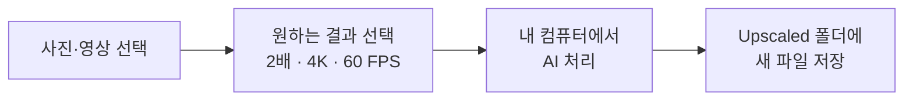
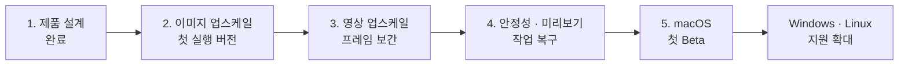

# Zoos Upscale

> 사진과 영상을 더 선명하고 부드럽게 만드는 로컬 AI 업스케일러

**현재 상태: 설계 완료 · 구현 준비 중**

> [!IMPORTANT]
> 아직 다운로드하거나 실행할 수 있는 버전은 없습니다. 현재는 제품 설계를 마치고 첫 번째 구현을 준비하는 단계입니다.

## 어떤 프로그램인가요?

Zoos Upscale은 사진과 영상을 내 컴퓨터에서 직접 개선하는 데스크톱 앱입니다.

- 작은 사진을 2배·4배로 선명하게 확대
- 영상을 FHD·4K 해상도로 업스케일
- 30 FPS 영상을 60 FPS처럼 부드럽게 보간
- 여러 파일을 차례로 처리하고 중단된 작업을 이어서 진행
- 원본은 건드리지 않고 결과를 새 파일로 저장

파일을 외부 서버에 올리지 않고 사용자의 컴퓨터에서 처리하는 것을 기본 원칙으로 합니다.

## 더 자세히 알아보기

개발 구조와 기술 선택이 궁금하다면 [기술 아키텍처 문서](ARCHITECTURE.md)를 참고하세요.

- 애플리케이션과 실행 엔진의 구성
- 이미지·영상 데이터 흐름
- 작업 중단·복구와 안전한 출력 방식
- AI 모델 및 하드웨어 백엔드 후보군
- 후보 기술을 실제 지원으로 승격하는 검증 기준

## 사용 흐름

사용자는 복잡한 AI 모델이나 GPU 설정 대신 원하는 결과만 선택합니다.

1. 사진이나 영상을 끌어다 놓습니다.
2. 원하는 해상도와 FPS를 선택합니다.
3. **처리 시작**을 누릅니다.
4. 완료된 파일을 확인합니다.

## 중요하게 생각하는 것

### 쉽고 단순하게

처음 사용하는 사람도 별도 공부 없이 바로 처리할 수 있는 화면을 목표로 합니다.

### 내 컴퓨터에서 안전하게

파일과 AI 처리는 기본적으로 모두 로컬에서 진행하며, 텔레메트리는 기본 비활성화할 계획입니다.

### 원본을 그대로

원본 파일은 수정하지 않습니다. 처리가 끝난 결과만 별도의 `Upscaled` 폴더에 저장합니다.

### 실패해도 다시 처음부터 하지 않게

긴 영상은 작은 구간으로 나누어 처리하고, 중단되더라도 확인된 지점부터 이어서 처리할 수 있도록 설계하고 있습니다.

## 개발 로드맵

- [x] 제품 범위와 기본 사용 흐름 설계
- [x] 이미지·영상 처리 방식 설계
- [x] 작업 중단·복구 및 원본 보호 정책 설계
- [ ] 데스크톱 앱 기본 화면
- [ ] 실제 이미지 업스케일
- [ ] 영상 프레임 보간과 업스케일
- [ ] macOS Apple Silicon Beta
- [ ] Windows 및 Linux 지원

## 지원 예정 플랫폼

1. **macOS Apple Silicon** — 첫 번째 Beta 목표
2. **Windows x64**
3. **Linux x64**

실제 장치에서 검증하지 않은 환경은 지원된다고 표시하지 않을 예정입니다.

## 자주 묻는 질문

### 지금 사용할 수 있나요?

아직은 사용할 수 없습니다. 첫 목표는 사진 한 장을 실제로 업스케일할 수 있는 최소 버전을 만드는 것입니다.

### 파일이 인터넷으로 전송되나요?

기본 동작에서는 전송하지 않습니다. 파일과 AI 처리는 로컬에서 수행하는 것을 원칙으로 합니다.

### 원본 파일을 덮어쓰나요?

아니요. 원본은 변경하지 않고 새 이름의 결과 파일을 생성합니다.

## 라이선스

프로젝트와 배포 구성요소의 라이선스는 첫 구현 단계에서 확정할 예정입니다.
