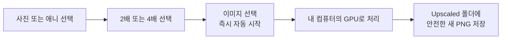
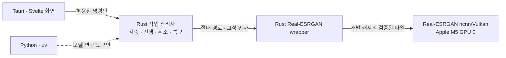
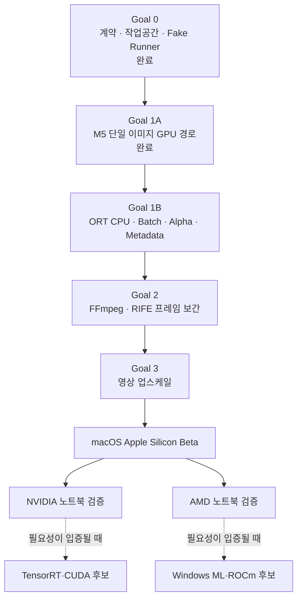

# Zoos Upscale

> 사진과 영상을 내 컴퓨터에서 선명하고 부드럽게 만드는 로컬 AI 업스케일러

**현재 상태: Goal 0 + Goal 1A 구현 완료 · Apple M5 이미지 업스케일 검증 완료**

> [!IMPORTANT]
> 아직 일반 사용자가 내려받을 수 있는 배포본은 없습니다. 개발 환경에서는 사진 한 장을 실제로 업스케일할 수 있지만, 엔진과 모델 가중치의 재배포 권리를 확인하기 전까지 공개 앱 번들에는 이를 넣지 않습니다.

## 지금 할 수 있는 일

현재 개발 버전의 범위는 일부러 작게 잡았습니다.

| 항목 | 현재 지원 |
|---|---|
| 입력 | RGB 8-bit PNG 또는 JPEG 한 장 |
| 프리셋 | 사진 / 애니·일러스트 |
| 배율 | 2배 / 4배 |
| AI 엔진 | Real-ESRGAN ncnn/Vulkan, GPU 0 |
| 출력 | 원본 옆 `Upscaled/` 폴더의 새 PNG |
| 검증 장치 | Apple M5 |

Apple M5에서 `사진·애니 × 2배·4배 × PNG·JPEG` 8개 조합을 각각 3회 실행했습니다. 모든 결과가 정확한 크기와 RGB8 형식이었고, 원본 SHA-256은 변하지 않았으며, 반복 결과는 커밋된 골든 이미지와 픽셀 단위로 같았습니다.

아직 지원하지 않는 항목은 다음 단계에서 추가합니다.

- 알파 채널, 회색조, 16-bit 이미지
- 회전 정보가 적용되지 않은 EXIF orientation
- 여러 파일 일괄 처리와 metadata·ICC·EXIF 보존
- GPU가 없을 때 사용하는 ONNX Runtime CPU 경로
- 영상 업스케일과 프레임 보간
- Windows·Linux 및 NVIDIA·AMD GPU 공식 검증

## 사용 흐름



사용자는 모델 이름이나 GPU 옵션을 다룰 필요가 없습니다.

1. **사진** 또는 **애니**를 고릅니다.
2. **2배** 또는 **4배**를 고릅니다.
3. **이미지 선택**을 누릅니다.
4. 진행률을 확인하거나 작업을 취소합니다.
5. 완료 화면에 표시된 결과 경로를 확인합니다.

## 파일을 어떻게 지키나요?

- 작업 시작 직전과 결과 공개 직전에 원본 SHA-256을 다시 확인합니다.
- AI가 만드는 파일은 숨겨진 `.partial.png`에 먼저 저장합니다.
- PNG 형식, RGB8, 정확한 배율, 비어 있지 않은 픽셀을 검증한 뒤에만 최종 이름으로 바꿉니다.
- 기존 결과와 이름이 겹치면 `_2`부터 새 이름을 찾고, 마지막 순간에 충돌해도 기존 파일을 덮어쓰지 않습니다.
- 실패·취소·강제 종료 후에는 이 작업이 소유한 partial과 미검증 결과를 정리합니다.
- 손상된 작업 기록은 삭제하지 않고 `quarantine/`으로 격리해 다른 작업과 앱 실행을 보호합니다.

결과에는 입력 전후 hash, 출력 hash·형식·크기를 담은 `verification.json` 기록이 남습니다.

## 어떻게 만들어졌나요?

화면, 작업 관리자, AI 엔진을 분리했습니다. 화면에는 파일 시스템이나 shell 권한을 주지 않고, Rust만 네이티브 파일 선택창과 실행 경로를 다룹니다.



제품 실행에는 Python이 필요하지 않습니다. Python과 `uv`는 모델 준비·품질 평가를 위한 개발 도구에서만 사용합니다.

세부 구조도, 데이터 흐름, 모델·백엔드 후보와 검증 기준은 [기술 아키텍처 문서](ARCHITECTURE.md)에 정리했습니다.

## 개발 환경에서 실행

현재 검증 기준은 macOS Apple Silicon, Node.js 22.22.3, pnpm 11.19.0, Rust 1.96.0입니다.

```bash
pnpm install --frozen-lockfile
pnpm engine:fetch
pnpm app:dev
```

엔진 자산 다운로드는 `pnpm engine:fetch`에서만 수행합니다. 이 명령은 공식 Real-ESRGAN macOS v0.2.5.0 패키지의 hash를 검증하고 필요한 실행기 1개와 모델 파일 4개만 `.cache/runtime-assets/`에 설치합니다. 빌드와 앱 실행은 자산을 자동 다운로드하지 않으며, 캐시는 Git과 공개 앱 번들에 포함되지 않습니다.

주요 자동 검증은 다음과 같습니다.

```bash
pnpm check
pnpm test
pnpm license:check
cargo fmt --all -- --check
cargo xtask schema --check
cargo clippy --workspace --all-targets --locked -- -D warnings
cargo test --workspace --locked
cargo deny check
```

Apple M5 실기 게이트는 [테스트 안내](tests/hardware/README.md)를 참고하세요. 기본 CI에서는 실제 GPU·로컬 모델을 요구하지 않도록 이 테스트를 제외합니다.

모델 연구 도구는 제품과 분리된 uv 환경을 사용합니다.

```bash
uv sync --project tools/model --locked
```

## 개발 로드맵



- [x] Tauri·Rust·Svelte 생산 스택과 Apache-2.0 라이선스 확정
- [x] 범용 작업 계약, schema 생성, 안전한 작업공간과 손상 격리
- [x] Real-ESRGAN 자산 catalog·hash 검증·라이선스 배포 게이트
- [x] 단일 RGB8 PNG/JPEG 사진·애니 2배·4배 GPU 업스케일
- [x] Apple M5 실제 Vulkan 회귀·취소 게이트
- [ ] Goal 1B CPU fallback·일괄 처리·alpha·metadata
- [ ] 영상 프레임 보간과 업스케일
- [ ] 서명·notarization을 포함한 macOS Beta
- [ ] NVIDIA·AMD 노트북의 공통 Vulkan·CPU 경로 검증

## 자주 묻는 질문

### 지금 사용할 수 있나요?

개발 환경에서는 사용할 수 있습니다. 일반 사용자를 위한 서명된 설치 파일은 아직 없으며, 엔진과 모델 가중치도 공개 앱에 포함하지 않습니다.

### 파일이 인터넷으로 전송되나요?

아니요. 이미지 선택과 AI 처리는 로컬에서 진행합니다. 엔진 자산은 개발자가 명시적으로 `pnpm engine:fetch`를 실행할 때만 고정된 공식 패키지에서 내려받습니다. 일반적인 패키지 설치는 각 언어의 package registry에 접속할 수 있습니다.

### 원본이나 기존 결과를 덮어쓰나요?

아니요. 원본은 hash로 재확인하고, 결과는 원본 옆 `Upscaled/`에 새 이름으로 저장합니다. atomic no-replace 공개가 실패하면 기존 파일을 그대로 둡니다.

### 왜 엔진과 모델을 앱에 넣지 않나요?

코드 라이선스와 모델 가중치 재배포 권리는 별개입니다. 현재 catalog는 `approved_for_distribution: false`이며, 권리와 고지 의무가 확인되기 전에는 release bundle 검사가 엔진·모델 포함을 차단합니다.

## 라이선스

Zoos Upscale의 자체 소스 코드는 [Apache License 2.0](LICENSE)으로 공개합니다. 외부 실행기, AI 모델 가중치와 향후 FFmpeg는 각각의 별도 라이선스와 고지 조건을 따릅니다.
