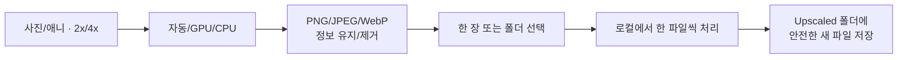
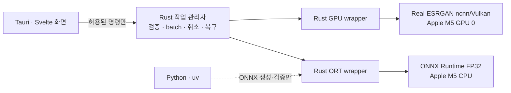
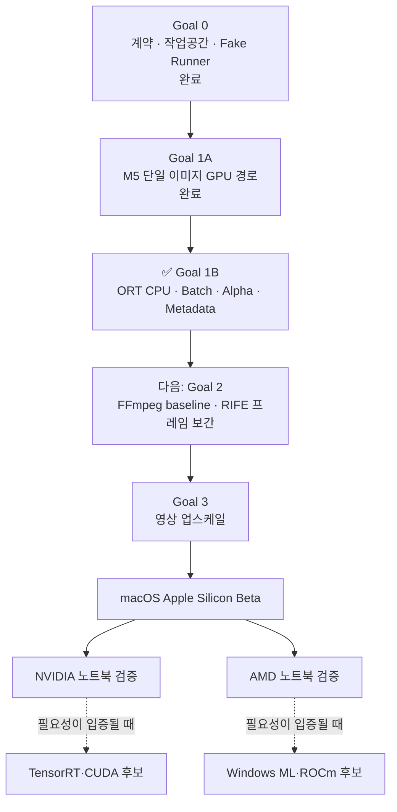

# Zoos Upscale

> 사진과 영상을 내 컴퓨터에서 선명하고 부드럽게 만드는 로컬 AI 업스케일러

**현재 상태: Goal 0 + Goal 1A + Goal 1B 구현 완료 · Apple M5 GPU·CPU 검증 완료**

> [!IMPORTANT]
> 아직 일반 사용자가 내려받을 수 있는 배포본은 없습니다. 개발 환경에서는 이미지 한 장이나 폴더를 실제로 처리할 수 있지만, 엔진과 모델 가중치의 재배포 권리를 확인하기 전까지 공개 앱 번들에는 이를 넣지 않습니다.

## 지금 할 수 있는 일

현재 개발 버전의 범위는 일부러 작게 잡았습니다.

| 항목 | 현재 지원 |
|---|---|
| 입력 | RGB/RGBA 8-bit PNG·JPEG 한 장 또는 폴더 최상위 파일 |
| 프리셋 | 사진 / 애니·일러스트 |
| 배율 | 2배 / 4배 |
| 실행 방식 | 자동 / ncnn·Vulkan GPU 0 / ONNX Runtime CPU |
| 출력 | PNG / JPEG 품질 95 / lossless WebP |
| 정보 정책 | ICC·EXIF 유지 또는 제거, EXIF 회전 적용 |
| 검증 장치 | Apple M5 |

Apple M5에서 기존 GPU 8개 조합과 Goal 1B의 CPU·GPU 사진/애니 2배·4배 경로를 실제 실행했습니다. CPU와 GPU는 고정 fixture에서 PSNR 50 dB 이상을 기록했고, alpha·EXIF 회전·ICC 유지/제거·JPEG/WebP·동일 이름 batch·취소 정리까지 통과했습니다. 원본 SHA-256은 모든 경로에서 변하지 않았습니다.

알아둘 제한은 다음과 같습니다.

- alpha가 있는 입력은 JPEG로 출력할 수 없습니다. PNG 또는 WebP를 선택해야 합니다.
- 회색조·16-bit 이미지와 입력 WebP는 아직 지원하지 않습니다.
- 폴더 처리는 하위 폴더를 재귀 탐색하지 않고 최상위 PNG/JPEG만 이름순으로 실행합니다.
- CPU는 호환성 경로라 GPU보다 많이 느릴 수 있습니다.
- 영상 업스케일과 프레임 보간
- Windows·Linux 및 NVIDIA·AMD GPU 공식 검증

## 사용 흐름



기본값인 `자동`은 검증된 GPU 실행 cache가 준비되어 있으면 GPU를, 없으면 CPU를 선택합니다. 한 번 시작한 작업이 실패해도 실행 중에 다른 backend로 조용히 바꾸지는 않습니다.

1. **사진** 또는 **애니**를 고릅니다.
2. **2배** 또는 **4배**를 고릅니다.
3. 기본 `자동·PNG·정보 유지`를 그대로 쓰거나 원하는 실행 방식과 출력을 고릅니다.
4. **이미지 선택** 또는 **폴더 일괄**을 누릅니다.
5. 진행률을 확인하거나 현재/전체 작업을 취소합니다.
6. 원본 옆 `Upscaled/`의 결과를 확인합니다.

## 파일을 어떻게 지키나요?

- 작업 시작 직전과 결과 공개 직전에 원본 SHA-256을 다시 확인합니다.
- alpha와 EXIF 회전은 AI 입력과 분리해 처리하고, RGB 추론 결과와 마지막에 다시 결합합니다.
- AI가 만드는 파일은 작업공간과 대상 폴더의 숨겨진 partial에 먼저 저장합니다.
- 형식, RGB/RGBA8, 정확한 배율, 비어 있지 않은 픽셀, ICC·EXIF 정책을 검증한 뒤에만 최종 이름으로 바꿉니다.
- 기존 결과와 이름이 겹치면 `_2`부터 새 이름을 찾고, 마지막 순간에 충돌해도 기존 파일을 덮어쓰지 않습니다.
- 실패·취소·강제 종료 후에는 이 작업이 소유한 partial과 미검증 결과를 정리합니다.
- 손상된 작업 기록은 삭제하지 않고 `quarantine/`으로 격리해 다른 작업과 앱 실행을 보호합니다.

결과에는 입력 전후 hash, 중간·출력 hash, backend·장치, runtime·모델 hash, 형식·크기와 alpha·ICC·EXIF 결과를 담은 검증 기록이 남습니다.

## 어떻게 만들어졌나요?

화면, 작업 관리자, AI 엔진을 분리했습니다. 화면에는 파일 시스템이나 shell 권한을 주지 않고, Rust만 네이티브 파일 선택창과 실행 경로를 다룹니다.



제품 실행에는 Python이 필요하지 않습니다. Python과 `uv`는 모델 준비·품질 평가를 위한 개발 도구에서만 사용합니다.

세부 구조도, 데이터 흐름, 모델·백엔드 후보와 검증 기준은 [기술 아키텍처 문서](ARCHITECTURE.md)에 정리했습니다.

## 개발 환경에서 실행

현재 검증 기준은 macOS Apple Silicon, Node.js 22.22.3, pnpm 11.19.0, Rust 1.96.0입니다.

```bash
pnpm install --frozen-lockfile
pnpm engine:fetch
pnpm goal1b:fetch
pnpm goal1b:models
pnpm app:dev
```

`engine:fetch`는 GPU 실행기·ncnn 모델, `goal1b:fetch`는 공식 ONNX Runtime과 원본 가중치를 검증된 개발 캐시에 둡니다. `goal1b:models`는 uv로 고정된 Python 도구를 사용해 두 ONNX FP32 모델을 결정론적으로 생성하고 catalog hash와 대조합니다. 네트워크와 모델 변환은 이 명시적 준비 단계에서만 일어나며 빌드·앱 실행은 자동 다운로드하지 않습니다. 캐시는 Git과 공개 앱 번들에 포함되지 않습니다.

주요 자동 검증은 다음과 같습니다.

```bash
pnpm check
pnpm test
pnpm license:check
cargo fmt --all -- --check
cargo xtask schema --check
cargo clippy --workspace --all-targets --locked -- -D warnings
cargo test --workspace --locked
cargo deny check
```

Apple M5 실기 게이트는 [테스트 안내](tests/hardware/README.md)를 참고하세요. 기본 CI에서는 실제 GPU·로컬 모델을 요구하지 않도록 이 테스트를 제외합니다.

Python은 이 모델 준비 단계에만 필요하며 제품 실행에는 포함되지 않습니다.

```bash
uv sync --project tools/model --extra export --locked
```

## 개발 로드맵



- [x] Tauri·Rust·Svelte 생산 스택과 Apache-2.0 라이선스 확정
- [x] 범용 작업 계약, schema 생성, 안전한 작업공간과 손상 격리
- [x] Real-ESRGAN 자산 catalog·hash 검증·라이선스 배포 게이트
- [x] 단일 RGB8 PNG/JPEG 사진·애니 2배·4배 GPU 업스케일
- [x] Apple M5 실제 Vulkan 회귀·취소 게이트
- [x] Goal 1B ORT CPU·일괄 처리·alpha·EXIF·ICC·JPEG·WebP
- [ ] 영상 프레임 보간과 업스케일
- [ ] 서명·notarization을 포함한 macOS Beta
- [ ] NVIDIA·AMD 노트북의 공통 Vulkan·CPU 경로 검증

## 자주 묻는 질문

### 지금 사용할 수 있나요?

개발 환경에서는 사용할 수 있습니다. 일반 사용자를 위한 서명된 설치 파일은 아직 없으며, 엔진과 모델 가중치도 공개 앱에 포함하지 않습니다.

### 파일이 인터넷으로 전송되나요?

아니요. 이미지 선택과 AI 처리는 로컬에서 진행합니다. 엔진·가중치는 개발자가 명시적으로 `pnpm engine:fetch` 또는 `pnpm goal1b:fetch`를 실행할 때만 고정된 공식 위치에서 내려받습니다. 일반적인 패키지 설치와 `goal1b:models`의 uv 환경 준비는 각 언어의 package registry에 접속할 수 있습니다.

### 원본이나 기존 결과를 덮어쓰나요?

아니요. 원본은 hash로 재확인하고, 결과는 원본 옆 `Upscaled/`에 새 이름으로 저장합니다. atomic no-replace 공개가 실패하면 기존 파일을 그대로 둡니다.

### 왜 엔진과 모델을 앱에 넣지 않나요?

코드 라이선스와 모델 가중치 재배포 권리는 별개입니다. 현재 catalog는 `approved_for_distribution: false`이며, 권리와 고지 의무가 확인되기 전에는 release bundle 검사가 엔진·모델 포함을 차단합니다.

## 라이선스

Zoos Upscale의 자체 소스 코드는 [Apache License 2.0](LICENSE)으로 공개합니다. 외부 실행기, AI 모델 가중치와 향후 FFmpeg는 각각의 별도 라이선스와 고지 조건을 따릅니다.
